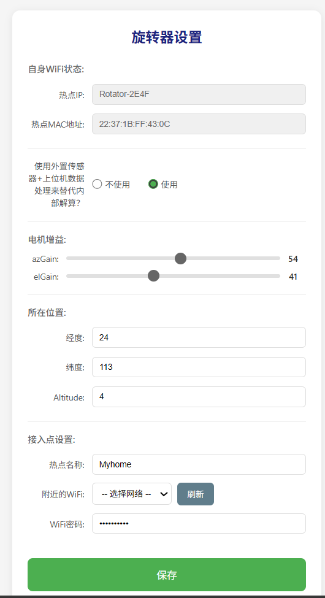

# 卫星天线旋转器开源固件 openRotator7

 openRotator7 是一款轻量级的卫星八木天线旋转器的固件，基于 **SARCNET Mini Rotator MK1** 的配套固件代码“Rotator7”进行移植和增强。保留了核心控制算法，同时增加了网络配置和用户交互功能。

  ## ✨ 功能特性

  ### 核心控制

  - LSM303DLHC 加速度计/磁力计数据读取、滤波与姿态解算
  - AMSAT EasyComm I/II 协议支持（兼容 Gpredict、WXtrack 等软件）
  - 电机驱动（支持 FWDREV / PWMDIR / ACMOTR 三种驱动模式）
  - 智能抗缠绕算法（450° 单向旋转限制）
  - 校准、调试、演示、监视多种工作模式

  ### 网络与配置

  - 内置 Web 配置页面，支持 Wi-Fi 网络扫描与选择
  - 配置持久化（SSID/密码/电机增益/外置传感器开关等）
  - TCP 控制端口（4533）
  - WebSocket 实时状态推送
  - OTA 固件更新（需使用 Arduino IDE 或 Python 工具，暂不支持 Web 界面上传）

  ### 硬件适配

  - 可适用于 DTrac Rotor V1 硬件设计（NodeMCU/ESP12E + LSM303DLHC + L298N，铸铝或 CNC 铝外壳+铝合金支架。如采用 DIY 硬件，请尽量避免铁磁性材料！）
  - **支持外置姿态传感器**：可通过 `XZ/XL` 命令上报当前角度，固件自行计算误差并驱动电机

  ## ⚙️ 硬件要求

  - **主控**：NodeMCU 或 ESP8266 开发板（推荐 **ESP07S**，可外接 SMA 天线）
  - **传感器**：GY-511（LSM303DLHC），或使用外置姿态传感器（如 WT9011DCL-BT50）
  - **电机驱动**：L298N 或兼容的 H 桥驱动板（目前固件配置为 ESP12E motor shield 板，板载 L298N 驱动）
  - **电源**：7.4V 锂电池（内置供电）或 DC 6~9V
  - **兼容硬件设计**：[DTrac Rotor V1](https://dtrac.cn/doku.php?id=dtrac_rotor_v1)，如采用其他开发板，请注意修改固件中的引脚配置！

  > 该设计原使用 ESP12E motor shield 电机开发板，但其使用的 ESP12E 或 ESP12F 开发板的天线为板载贴片微带天线，考虑到旋转器外壳为金属，会遮蔽 WiFi 信号，故推荐引脚兼容的 NodeMCU ESP07S 开发板，通过 IPEX 天线座引出 SMA 天线接口，接外置天线。

  ## 📡 控制协议

  ### 标准 EasyComm I/II 协议（TCP 端口 4533）

  - **设置目标角度**：`AZ180.5 EL45.2\n`
  - **查询方位角**：`AZ\n` → 返回 `AZ180.5\n`
  - **查询仰角**：`EL\n` → 返回 `EL45.2\n`

  ### 串口命令（使用 CR `\r` 结尾）

  支持 `r`, `c`, `s`, `a`, `d`, `b`, `m`, `p`, `h`, `eNN.N`, `<az> <el>` 等命令。

  ### 外置传感器上报命令（`XZ`/`XL`）

  当 Web 页面中 **External Sensor** 设为 **Yes** 时，固件会忽略内置 LSM303DLHC 传感器，完全依赖外部上报的角度数据。

  | 命令格式        | 示例             | 说明                              |
  | :-------------- | :--------------- | :-------------------------------- |
  | `XZ<角度>`      | `XZ135.5`        | 上报当前方位角（单位：度，0~360） |
  | `XL<角度>`      | `XL42.0`         | 上报当前仰角（单位：度，-90~90）  |
  | `XZ<az> XL<el>` | `XZ135.5 XL42.0` | 同时上报方位角和仰角              |

  > **使用场景**：当使用外置姿态传感器（如 WT9011DCL-BT50）时，上位机（需要自行实现）通过蓝牙或串口获取传感器数据并解算出当前角度，然后通过串口发送 `XZ/XL` 命令给旋转器。旋转器收到后，会结合之前通过 `AZ/EL` 设定的目标角度，自行计算误差并驱动电机。

  ### Web API

  - `POST /cmd`：发送控制命令（支持 `AZ/EL`、`XZ/XL`、`r`、`c` 等所有命令）
  - `GET /AzEl`：获取当前角度，返回 `az,el`

  ## 🚀 快速开始

  ### 烧录固件

  1. 使用 Arduino IDE 或 PlatformIO 打开项目
  2. 选择开发板：`NodeMCU 1.0 (ESP-12E Module)`
  3. 编译并上传固件
  4. 首次开机后，连接 Wi-Fi 热点 `Rotator7-xxxx`（密码：`12345678`）

  ### 首次配置

  > **首次配置推荐使用 Web 页面**：连接旋转器 Wi-Fi 热点后，在浏览器中即可完成所有设置。串口命令行方式仅为高级用户和开发者提供。

  1. 在浏览器访问 `http://192.168.4.1`
  2. 配置 Wi-Fi SSID/密码，或保留默认 AP 模式
  3. 设置本地磁偏角（可通过网络查询）、电机增益等
  4. **选择传感器模式**：
     - **Internal Sensor（默认）**：使用板载 LSM303DLHC，需完成下方传感器校准
     - **External Sensor**：使用外置姿态传感器，固件将忽略 LSM303DLHC 的全部数据，完全依赖 `XZ/XL` 命令上报的当前角度

  

### 传感器校准（仅内部传感器模式需要）

  > **建议在首次使用时进行一次完整的传感器校准**。传感器在焊接、安装到 PCB 后，都会存在不同程度的**硬铁干扰（Hard Iron）**和**软铁干扰（Soft Iron）**。此外，旋转器的电机、金属支架如果采用了铁磁材料也会扭曲周围的磁场。如果不进行校准，传感器会给出一个“偏斜”的地球磁场读数，导致旋转器的方位角出现**固定偏差**或**非线性误差**，跟踪精度会大打折扣。

  1. 通过串口发送 `c` 进入校准模式
  2. 缓慢旋转天线，使传感器在尽可能多的方向充分采样，每个方向停留几秒。在转动过程中，蜂鸣器偶尔会“滴”声作响，表示正在采集数据；当所有方向都转过后，蜂鸣器应当完全安静下来
  3. 发送 `s` 保存校准数据
  4. 发送 `a` 退出校准模式
  5. 完成后，可将天线指向正北，发送 `0 0` 指令验证指向是否准确。如有偏差，请检查磁偏角设置并重新校准

  ### OTA（空中升级）功能

  1. 确保设备处于 **STA 模式**（已连接到你的局域网）
  2. 在 Arduino IDE 中，选择对应的端口（会显示为 `rotator7` 的网络端口）或使用 Python 工具通过 OTA 库上传
  3. 上传时需要输入密码 `rotota`

  > **注意**：OTA 功能**仅在 STA 模式下可用**。如果设备处于 AP 模式（作为热点），则无法进行 OTA 升级，此时仍需通过串口烧录。

  ## 🔄 内部传感器 vs 外置传感器模式

| 特性             | 内部传感器模式（默认）           | 外置传感器模式                                         |
| :--------------- | :------------------------------- | :----------------------------------------------------- |
| **角度数据来源** | 板载 LSM303DLHC                  | 上位机通过 `XZ/XL` 命令上报                            |
| **是否需要校准** | ✅ 必须完成 `c` → 转动 → `s` 流程 | ❌ 不需要（外置传感器自行校准）                         |
| **磁偏角设置**   | ✅ 通过 `e` 命令或 Web 页面设置   | ❌ 不需要（外置传感器或上位机处理）                     |
| **调试模式 `b`** | ✅ 可用，打印原始传感器数据       | ❌ 禁用（无内部传感器数据）                             |
| **校准模式 `c`** | ✅ 可用                           | ❌ 禁用（提示“仅内部传感器模式可用”）                   |
| **防缠绕保护**   | ✅ 有效                           | ✅ 有效（基于上报的角度变化）                           |
| **搬动支架后**   | 需要发送 `r` 复位                | 无需操作（上位机会持续上报新角度）                     |
| **适用场景**     | 独立工作，无需上位机辅助         | 配合外置姿态传感器使用，需要上位机发送额外数据给旋转器 |

  **外置传感器模式的优势**：

  - 不需要手动连线到内部电路板，外观整洁
  - 搬动支架后无需复位
  - 可使用更高精度的外置传感器（如 WT9011DCL-BT50）
  - 适合追求更高指向精度的用户

  **外置传感器模式的缺点：**

- 需要在上位机配置hamlib rotctld来发送传感器数据，门槛较高

- 传感器设备需要充电（续航24小时左右）

- 目前暂不兼容DTrac app

**外置传感器模式的工作流程**：

- 上位机通过蓝牙获取外置传感器数据
- 上位机得知天线的当前姿态
- 上位机通过 TCP/串口发送 XZ<az> XL<el>
- 旋转器收到后更新当前角度，结合目标角度 AZ/EL
- 旋转器自行计算误差，驱动电机

 ## 🔧 工作模式

  当在串口监视器中输入对应的命令后，设备会进入特定的工作模式：

| 模式         | 触发命令 | 主要功能           | 表现                                                 |
| :----------- | :------- | :----------------- | :--------------------------------------------------- |
| **调试模式** | `b`      | 输出原始传感器数据 | 串口持续打印 `mx, my, mz, gx, gy, gz` 六个原始数值。 |
| **演示模式** | `d`      | 自动往复旋转       | 按预设路径自动转动，适合展示或测试机械结构           |
| **监视模式** | `m`      | 输出详细运行状态   | 打印当前角度、目标角度、缠绕角度、误差值等           |
| **校准模式** | `c`      | 传感器校准         | 需人工配合转动设备，完成后用 `s` 保存                |

  退出所有模式：发送 `a`（abort），设备回到默认的**跟踪模式**。

> 如使用外部传感器， 调试模式和校准模式不可用。

  ## 🔊 蜂鸣器

  | 场景           | 声音       | 说明                               |
  | :------------- | :--------- | :--------------------------------- |
  | **开机启动**   | 短促两声   | EEPROM 读取后、Wi-Fi 启动前发出    |
  | **校准模式**   | 短促“滴”声 | 转动设备时，传感器数据更新即响一声 |
  | **低电压报警** | ❌ 未实现   | 本固件暂未实现该功能               |

  ## 📋 串口命令完整列表

  普通用户不需要使用串口命令。大部分初始化设置在 Web 界面即可完成。串口命令主要面向：手动控制角度、传感器校准、调试/监视模式。

| 命令格式             | 参数示例         | 功能说明                                                     | 终止符 |
| :------------------- | :--------------- | :----------------------------------------------------------- | :----- |
| **`r`**              | `r`              | **复位**：重置旋转器状态，将当前指向设为参考零点，清除缠绕计数 | `\r`   |
| **`h`**              | `h`              | **帮助**：打印所有可用命令                                   | `\r`   |
| **`c`**              | `c`              | **校准模式**（仅内部传感器可用）                             | `\r`   |
| **`s`**              | `s`              | **保存校准数据**到 EEPROM（仅内部传感器可用）                | `\r`   |
| **`a`**              | `a`              | **中止**：退出当前模式，返回跟踪模式                         | `\r`   |
| **`b`**              | `b`              | **调试模式**（仅内部传感器可用）                             | `\r`   |
| **`m`**              | `m`              | **监视模式**                                                 | `\r`   |
| **`d`**              | `d`              | **演示模式**                                                 | `\r`   |
| **`p`**              | `p`              | **暂停/恢复**电机闭环控制                                    | `\r`   |
| **`eNN.N`**          | `e11.7`          | **设置磁偏角**（仅内部传感器可用）                           | `\r`   |
| **`<az> <el>`**      | `180 45`         | **手动控制**：设置目标角度                                   | `\r`   |
| **`AZ`**             | `AZ`             | **查询方位角**                                               | `\n`   |
| **`EL`**             | `EL`             | **查询仰角**                                                 | `\n`   |
| **`AZnn.n ELnn.n`**  | `AZ180.5 EL45.2` | **设置目标角度**（EasyComm 标准）                            | `\n`   |
| **`XZnn.n XL nn.n`** | XZ135.5 XL40.3        | **上报外置传感器获取到的角度**（仅外置传感器模式）         | `\n`   |

  **常见问题排查**：

  - **命令无响应**：检查波特率是否为 **115200**，确认“发送新行”的设置是否正确（CR 或 LF）
  - **`AZ180 EL45` 无效**：EasyComm 命令需要以 **`\n`** 结尾
  - **`180 45` 无效**：手动控制命令需要以 **`\r`** 结尾

  ## ⚙️ 电机增益调整

  电机增益（Gain）决定了旋转器对角度误差的反应灵敏度。

  | 设置         | 效果                 | 优点                           | 缺点                             |
  | :----------- | :------------------- | :----------------------------- | :------------------------------- |
  | **增益值高** | 电机反应强烈，转动快 | 响应迅速，跟踪快速卫星更跟得上 | 容易过冲、震荡、噪声大、耗电增加 |
  | **增益值低** | 电机动作柔和，转动慢 | 动作平滑、指向稳定、电机寿命长 | 响应迟钝，快速目标时滞后明显     |

  - **默认值 25**：适合中等重量且做了配重的天线。
  - **天线较重（>1.5kg）或平衡不佳**：增加到 **35-50**
  - **天线轻巧且平衡良好**：降低到 **15-20**
  - **出现持续震荡**：**增益过高**，应降低
  - **反应迟钝，明显滞后**：**增益过低**，应增加

  ## 🔄 什么时候需要重新校准？

  校准数据存储在 ESP8266 的模拟 EEPROM 中，掉电不丢失。仅在以下情况需要重新校准：

  - 首次组装完成时
  - 传感器被拆卸或重新安装（位置或方向改变）
  - 天线支架上增加了新的铁磁性部件（如铁质法兰、螺丝）
  - 指向精度明显下降，且排除磁偏角设置错误
  - 更换了不同型号的传感器板

  > **如果不属于以上情况，则无需重复校准。**

  ## 🤝 致谢 & 衍生说明

  - **原始项目**：[SARCNET Mini Rotator MK1](http://www.sarcnet.org) — 由 Julie VK3FOWL 和 Joe VK3YSP 开发，基于 GPLv3 许可证发布
  - **兼容硬件设计**：DTrac Rotor V1 — 由 BG6UD 设计并开源硬件资料。但该固件并不属于 DTrac 项目的一部分。
  - **本固件**：基于上述开源项目进行移植和功能增强。

  ## 📜 开源协议

  本项目基于 **GNU General Public License v3.0** 开源。请阅读 [LICENSE](LICENSE) 文件了解详情。

  ## 📞 联系我们 / 贡献

  欢迎提交 Issue 和 Pull Request。

Copyright  (c) 2026 BH5UNT